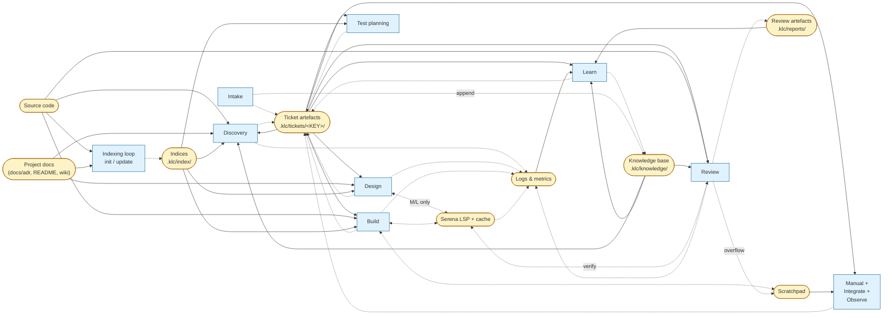
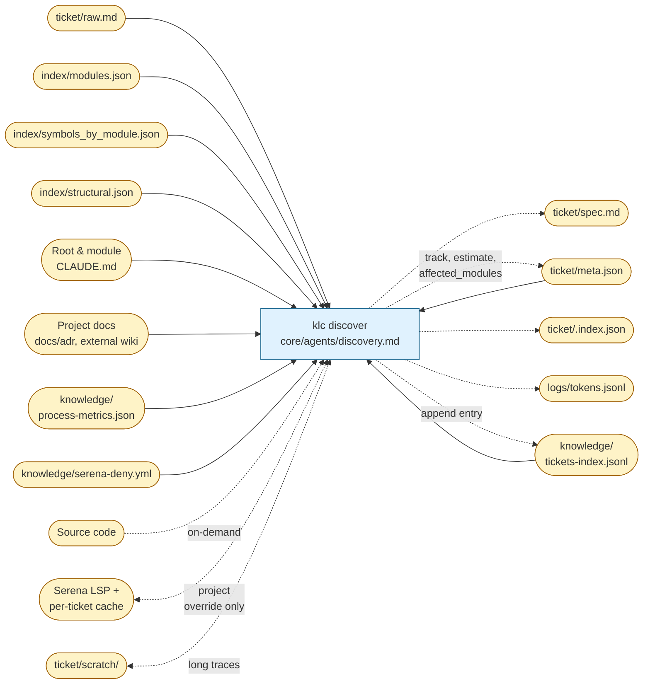
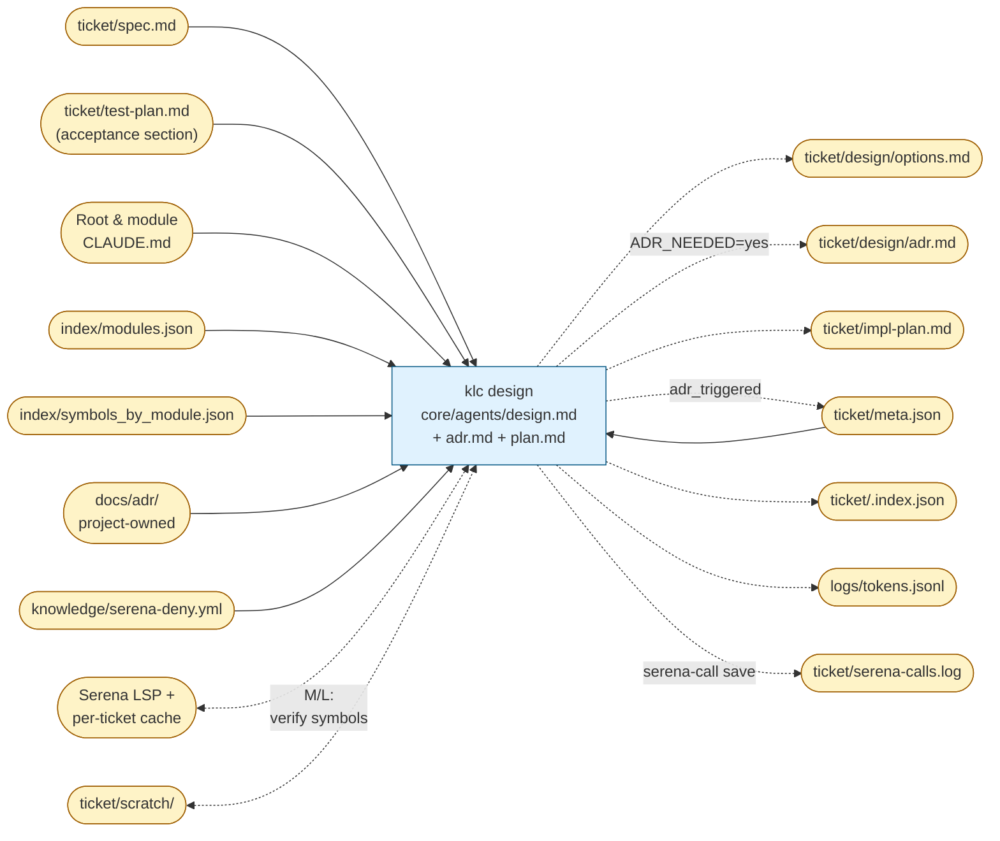
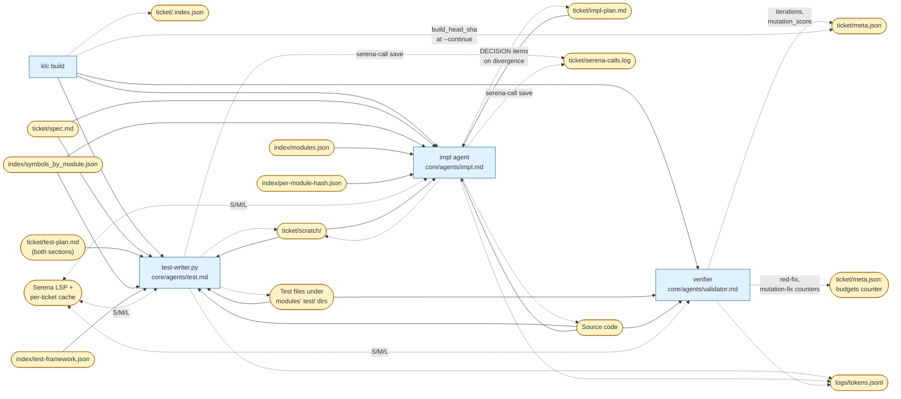

# Role map — who does what across the phases

One row per phase. "Human" / "Agent" / "Script" / "Tool" columns show
who is responsible; links point to the file that implements the role.

Legend:
- **Human** — a decision only a person can make (intent, direction,
  merge approval, manual sign-off).
- **Agent** — LLM prompt at `core/agents/*.md` executed by Claude Code
  (or any MCP-capable client).
- **Script** — executable at `scripts/*` or `core/phases/*.py` called
  via the `klc` dispatcher.
- **Tool** — MCP server or CLI tool the script/agent uses: Serena,
  ast-grep, git, external reviewer LLMs.

The entire flow is driven by `scripts/klc` — one dispatcher,
subcommands per phase. Legacy wrappers `feature.sh` / `bug.sh` are
deprecated; see `MIGRATION.md`.

| # | Phase | Human | Agent | Script | Tool |
|---|-------|-------|-------|--------|------|
| — | init (one-off) | — | `core/agents/inventory.md` + `core/agents/decompose.md` + `core/agents/docgen.md` | `scripts/init.sh` | ast-grep, git |
| — | update (cron) | — | `core/agents/periodic.md` | `scripts/update.sh` | ast-grep, git, `serena-call` on L only |
| 0 | Intake | types the raw description | `core/agents/intake.md` | `klc intake <key> "<desc>"` (`core/phases/intake.py`) | git (reads user config) |
| 1 | Discovery | acks pull-ready + track | `core/agents/discovery.md` (wraps `core/agents/validator.md`) | `klc discover <key>` (`core/phases/discover.py`) | ast-grep; Serena only on L with override |
| 2 | Acceptance test plan | — | `core/agents/test-planner.md` (acceptance mode) | `klc test-plan <key>` (`core/phases/test_plan.py`) | — |
| 3 | Design | acks direction + ADR | `core/agents/design.md` + `core/agents/adr.md` + `core/agents/plan.md` | `klc design <key>` (`core/phases/design.py`) | Serena (verify symbols on M/L via `serena-call.py`) |
| 4 | Detailed test plan | — | `core/agents/test-planner.md` (detailed mode) | `klc test-plan <key> --detailed` (`core/phases/test_plan.py`) | — |
| 5 | Build | watches on escalation signals | `core/agents/test.md` + `core/agents/impl.md` + `core/agents/validator.md` | `klc build <key>` (`core/phases/build.py`) | Serena, ast-grep, test runners, mutation tools |
| 6 | Review | acks merge approval | `core/agents/review.md` + `core/agents/review/*.md` | `klc review <key>` (`core/phases/review.py` — thin wrapper over `review.sh`) | Serena (reviewers verifying signatures), external reviewer LLM (optional) |
| 7 | Manual check | ticks the checklist | `core/agents/manual-check.md` | `klc manual <key>` (`core/phases/manual.py`) | — |
| 8 | Integrate | runs `git merge` between `pre` and `post` | `core/agents/consistency.md` (wraps `consistency_check.py`) | `klc integrate pre <key>`; `klc integrate post <key> --merge-sha <sha>` (`core/phases/integrate.py`) | git, `items.py validate`, `consistency_check.py` |
| 9 | Observe (optional) | — | — (no-op today; CI hook later) | `klc observe <key>` (`core/phases/observe.py`) | — |
| 10 | Learn | reviews proposed allowlist / few-shot edits | `core/agents/retrospective.md` | `klc learn <key>` (`core/phases/learn.py`) | `metrics.py rollup`, `serena_deny.py propose` |

## Operational commands (not phases)

| Command | Agent | Script | Purpose |
|---|---|---|---|
| `klc ack <key> --for <phase>` | — | `core/phases/ack.py` | Satisfy a human-gate. Required to leave `*-pending-ack` phases. |
| `klc back <key> --to <phase> --reason "..."` | — | `core/phases/back.py` → `lifecycle.py:back` | Rework. Only way to move a ticket backwards. |
| `klc status <key>` | — | `core/phases/status.py` | Human-readable diagnosis: current phase, pending issues, budget state. |
| `klc resume <key>` | — | `core/phases/resume.py` | Re-enter the interrupted phase idempotently. |
| `klc doctor` | — | `core/phases/doctor.py` | Install-level health check. Safe on CI. |
| `klc board` | — | `core/phases/board.py` | Kanban view of all tickets by current phase. |
| `klc metrics <key>` / `klc metrics --rollup` | — | `core/skills/metrics.py` | Per-ticket JSON or 30-day rollup. |
| `klc reindex <key>` | — | `core/skills/items.py index` | Rebuild `.index.json` of inline items. |

## Tools used across phases

- **Serena** (LSP-backed symbol queries). Gated by `core/skills/serena-call.py`; track-aware policy blocks XS from all phases, S outside Build, etc. Cache per-ticket at `.klc/tickets/<key>/serena-cache/`.
- **ast-grep** — structural code search (profile rules at `profiles/<name>/rules/`). Available everywhere, no gate.
- **git** — every phase that touches files expects a clean-enough working tree. `klc doctor` surfaces `git status` warnings.
- **Test runners / mutation tools** — detected at `klc test-plan` time and recorded in `.klc/index/test-framework.json`. Not framework-shipped; install per project.

## Data stores and command I/O

Four diagrams. The first is a high-level summary: who writes to
each data store and who reads it, at the level of command groups.
The next three drill into the heavy-context phases — Discovery,
Design, Build — where the I/O decisions directly drive how much
context each agent consumes.

**Conventions (shared across all four diagrams):**

- Rounded nodes (`([...])`) are durable data stores.
- Rectangles are commands (phase scripts from `core/phases/`, plus
  the two indexing-loop scripts `init.sh` / `update.sh`).
- Solid arrows are reads, dashed arrows are writes.
- Labels on arrows mark conditional flow (track-specific, or only
  on certain inputs).

### Diagram 1 — Overview: who writes / who reads

Per-store summary at the group level. Discovery, Design, Build,
Review and Learn are shown as monolithic blocks — detail lives in
the next three diagrams and in the overall phase map. The point of
this one is to see the **asymmetry**: Learn is almost the only
writer of knowledge; indexing is almost the only writer of indices;
every phase script reads its predecessors' artefacts.

Key observations:

- **Knowledge** has one regular writer (Learn) plus a single
  append-only touch from Intake. Every other phase only reads it.
- **Indices** are written by the indexing loop and read by every
  design-time phase. No ticket script writes them.
- **Serena** is gated: always dashed + conditional. XS tickets
  don't talk to it at all.
- **Logs** are fan-in from most phases, fan-out to Learn only.

### Diagram 2 — Discovery

Discovery is the widest fan-in of the ticket flow and the second-
biggest LLM spend after Build. The agent is deliberately kept off
Serena on M / L (track-policy in `core/skills/serena-call.py`); it
leans on the materialized indices instead.

Why so many read arrows: Discovery is the only phase that has to
bridge between raw human text (`raw.md`), project structure
(indices + CLAUDE.md), institutional memory (knowledge base) and —
rarely — code. Without the indices this fan-in would be direct from
source, which is what the overall design prevents.

### Diagram 3 — Design

Design's I/O is narrower but deeper. It reads the acceptance
test plan written in phase 2 to make sure the option choice
respects it. Serena access is the first heavy use: symbol
verification is mandatory for every symbol mentioned in options /
ADR on M/L tickets.

Three edges worth noting:

- `tplan → design` is what makes TDD real: the option evaluation
  knows which acceptance tests must stay easy to write.
- `adrhist → design` brings prior project-wide decisions into the
  options context; it's why design starts inside known constraints.
- Every arrow into `serena` is gated by `serena-call.py` — the
  denylist (`deny` node) and per-ticket cache filter each query.

### Diagram 4 — Build

Build is where everything meets: code changes, test writes, Serena
reads to avoid hallucinating signatures, scratch for long iteration
traces, budget counters to bound the loop. Most store edges here
are bidirectional because the TDD loop reads, writes, re-reads.

Four things to read off this diagram:

- **Tests and code are the only durable outputs** — everything else
  is meta. The whole diagram exists to make that one arrow
  (`implw -.-> code`) trustworthy.
- **Bidirectional with `scratch`**: the test and impl agents dump
  intermediate reasoning (failing stack traces, candidate fixes) to
  the scratchpad and re-read it on the next iteration. Without it
  the TDD loop either pollutes `impl-plan.md` or re-does the same
  reasoning.
- **`per-module-hash.json` is the drift alarm**: if an impl step
  changes a module's public API, the hash changes, periodic flags
  it, and the next Discovery on a related ticket knows the
  surroundings shifted.
- **Budget counters live in `meta.json`** (shown as a separate node
  for clarity). The verifier bumps them; when a counter trips its
  limit the phase script writes `meta.json:blocked_reason` and
  stops — the human takes over.

### Commands absent from these diagrams by design

- **Operational commands** (`klc status`, `klc board`, `klc doctor`,
  `klc ack`, `klc back`, `klc reindex`). They read
  `ticket/meta.json` and `knowledge/tickets-index.jsonl` only;
  drawing them on top of diagrams 2–4 would clutter the I/O story
  without new architectural signal.
- **Review sub-agents** (security, architecture, performance,
  test-coverage, + profile-specific ones for UE etc.). They share
  the same inputs/outputs as `klc review`; they sit behind that one
  node on diagram 1. Per-sub-agent I/O is not architectural — each
  one reads the same bundle and writes a partial.
- **Test planning, Manual, Integrate, Observe, Learn**. Their I/O
  is either obvious from the artefact naming (manual,
  retrospective) or already implied by diagram 1. If a later
  agent-context review shows one of them grew expensive, it earns
  its own diagram.

## Human-gate summary

Default count: **3 obligatory + 1 conditional**.

1. `klc ack <key> --for discovery` — pull-ready.
2. `klc ack <key> --for design` — direction.
3. `klc ack <key> --for review` — merge approval.
4. `klc ack <key> --for manual` — only when `manual` axis ≥ 2.

Everything else is LLM-driven. Agents escalate to human on the
signals enumerated in `process-phases.md` §11, not on a schedule.
