# Role map — who does what across the phases

One row per phase. "Human" / "Agent" / "Script" / "Tool" columns show
who is responsible; links point to the file that implements the role.

Legend:
- **Human** — a decision only a person can make (intent, direction,
  merge approval, manual sign-off).
- **Agent** — LLM prompt at `core/agents/*.md` executed by Claude Code
  (or any MCP-capable client).
- **Script** — executable at `scripts/*` or `core/phases/*.py` called
  via the `klc` dispatcher.
- **Tool** — MCP server or CLI tool the script/agent uses: Serena,
  ast-grep, git, external reviewer LLMs.

The entire flow is driven by `scripts/klc` — one dispatcher,
subcommands per phase. Legacy wrappers `feature.sh` / `bug.sh` are
deprecated; see `MIGRATION.md`.

| # | Phase | Human | Agent | Script | Tool |
|---|-------|-------|-------|--------|------|
| — | init (one-off) | — | `core/agents/inventory.md` + `core/agents/decompose.md` + `core/agents/docgen.md` | `scripts/init.sh` | ast-grep, git |
| — | update (cron) | — | `core/agents/periodic.md` | `scripts/update.sh` | ast-grep, git, `serena-call` on L only |
| 0 | Intake | types the raw description | `core/agents/intake.md` | `klc intake <key> "<desc>"` (`core/phases/intake.py`) | git (reads user config) |
| 1 | Discovery | acks pull-ready + track | `core/agents/discovery.md` (wraps `core/agents/validator.md`) | `klc discover <key>` (`core/phases/discover.py`) | ast-grep; Serena only on L with override |
| 2 | Acceptance test plan | — | `core/agents/test-planner.md` (acceptance mode) | `klc test-plan <key>` (`core/phases/test_plan.py`) | — |
| 3 | Design | acks direction + ADR | `core/agents/design.md` + `core/agents/adr.md` + `core/agents/plan.md` | `klc design <key>` (`core/phases/design.py`) | Serena (verify symbols on M/L via `serena-call.py`) |
| 4 | Detailed test plan | — | `core/agents/test-planner.md` (detailed mode) | `klc test-plan <key> --detailed` (`core/phases/test_plan.py`) | — |
| 5 | Build | watches on escalation signals | `core/agents/test.md` + `core/agents/impl.md` + `core/agents/validator.md` | `klc build <key>` (`core/phases/build.py`) | Serena, ast-grep, test runners, mutation tools |
| 6 | Review | acks merge approval | `core/agents/review.md` + `core/agents/review/*.md` | `klc review <key>` (`core/phases/review.py` — thin wrapper over `review.sh`) | Serena (reviewers verifying signatures), external reviewer LLM (optional) |
| 7 | Manual check | ticks the checklist | `core/agents/manual-check.md` | `klc manual <key>` (`core/phases/manual.py`) | — |
| 8 | Integrate | runs `git merge` between `pre` and `post` | `core/agents/consistency.md` (wraps `consistency_check.py`) | `klc integrate pre <key>`; `klc integrate post <key> --merge-sha <sha>` (`core/phases/integrate.py`) | git, `items.py validate`, `consistency_check.py` |
| 9 | Observe (optional) | — | — (no-op today; CI hook later) | `klc observe <key>` (`core/phases/observe.py`) | — |
| 10 | Learn | reviews proposed allowlist / few-shot edits | `core/agents/retrospective.md` | `klc learn <key>` (`core/phases/learn.py`) | `metrics.py rollup`, `serena_deny.py propose` |

## Operational commands (not phases)

| Command | Agent | Script | Purpose |
|---|---|---|---|
| `klc ack <key> --for <phase>` | — | `core/phases/ack.py` | Satisfy a human-gate. Required to leave `*-pending-ack` phases. |
| `klc back <key> --to <phase> --reason "..."` | — | `core/phases/back.py` → `lifecycle.py:back` | Rework. Only way to move a ticket backwards. |
| `klc status <key>` | — | `core/phases/status.py` | Human-readable diagnosis: current phase, pending issues, budget state. |
| `klc resume <key>` | — | `core/phases/resume.py` | Re-enter the interrupted phase idempotently. |
| `klc doctor` | — | `core/phases/doctor.py` | Install-level health check. Safe on CI. |
| `klc board` | — | `core/phases/board.py` | Kanban view of all tickets by current phase. |
| `klc metrics <key>` / `klc metrics --rollup` | — | `core/skills/metrics.py` | Per-ticket JSON or 30-day rollup. |
| `klc reindex <key>` | — | `core/skills/items.py index` | Rebuild `.index.json` of inline items. |

## Tools used across phases

- **Serena** (LSP-backed symbol queries). Gated by `core/skills/serena-call.py`; track-aware policy blocks XS from all phases, S outside Build, etc. Cache per-ticket at `.klc/tickets/<key>/serena-cache/`.
- **ast-grep** — structural code search (profile rules at `profiles/<name>/rules/`). Available everywhere, no gate.
- **git** — every phase that touches files expects a clean-enough working tree. `klc doctor` surfaces `git status` warnings.
- **Test runners / mutation tools** — detected at `klc test-plan` time and recorded in `.klc/index/test-framework.json`. Not framework-shipped; install per project.

## Data stores and command I/O

The diagram below shows which data store each principal command
reads from and writes to. Its purpose is architectural: it makes
explicit which stores would otherwise be loaded into an agent's
context on every invocation — and why indirection via a store is
what keeps that context small.

Conventions:

- Boxes with **rounded** corners (`([...])`) are durable data
  stores on disk (or in Serena's own cache).
- Rectangles are commands (phase scripts from `core/phases/` plus
  the two indexing-loop scripts `init.sh` / `update.sh`).
- **Solid** arrows are reads, **dashed** arrows are writes.
- Dotted edges carry a label when the flow is conditional on
  track or phase.

```mermaid
flowchart LR
    %% ============ data stores ============
    code(["Source code<br/>(project tree)"])
    projdocs(["Project docs<br/>docs/adr, README,<br/>external wiki"])
    index(["Deterministic indices<br/>.klc/index/<br/>(structural / inventory /<br/>modules / symbols_by_module /<br/>depgraph)"])
    tickets(["Ticket artefacts<br/>.klc/tickets/&lt;KEY&gt;/<br/>spec, design, impl-plan,<br/>test-plan, .index.json"])
    knowledge(["Knowledge base<br/>.klc/knowledge/<br/>tickets-index, process-metrics,<br/>reviewer-allowlist, serena-deny,<br/>few-shot"])
    scratch(["Scratchpad<br/>.klc/tickets/&lt;KEY&gt;/scratch/"])
    serena(["Serena LSP graph<br/>+ per-ticket cache<br/>.klc/tickets/&lt;KEY&gt;/serena-cache/"])
    reviews(["Review artefacts<br/>.klc/reports/"])
    logs(["Logs &amp; metrics<br/>.klc/logs/,<br/>serena-calls.log"])

    %% ============ indexing loop ============
    init[init.sh]
    update[update.sh]

    code -->|scan| init
    projdocs -->|read| init
    init -.->|write| index
    init -.->|seed| knowledge

    code -->|diff since last run| update
    index -->|old snapshot| update
    update -.->|patch| index

    %% ============ ticket flow ============
    intake[klc intake]
    discover[klc discover]
    design[klc design]
    testplan[klc test-plan /<br/>--detailed]
    build[klc build]
    review[klc review]
    manual[klc manual]
    integrate[klc integrate<br/>pre / post]
    observe[klc observe]
    learn[klc learn]

    %% intake: creates ticket, touches knowledge index only.
    intake -.->|create| tickets
    intake -.->|append row| knowledge

    %% discover: reads heavy; no Serena on M/L by policy.
    tickets -->|raw.md| discover
    index -->|modules,<br/>symbols_by_module| discover
    projdocs -->|CLAUDE.md<br/>+ external docs| discover
    knowledge -->|related tickets| discover
    discover -.->|write spec.md,<br/>meta.json| tickets

    %% design: reads ticket + indices + Serena (M/L only).
    tickets -->|spec,<br/>test-plan| design
    index -->|symbols_by_module| design
    serena -.->|verify symbols<br/>M/L only| design
    design -.->|options, adr,<br/>impl-plan| tickets
    design -.->|Serena writes| serena

    %% test planning: reads spec (acceptance)
    %% or spec+design (detailed). No code reads; it only plans.
    tickets -->|spec, design,<br/>impl-plan| testplan
    testplan -.->|test-plan.md| tickets

    %% build: the heavy loop.
    tickets -->|impl-plan,<br/>test-plan| build
    code -->|source reads| build
    index -->|symbols_by_module| build
    serena -.->|symbol checks| build
    build -.->|code &amp; tests| code
    build -.->|commits| code
    build -.->|impl-plan updates| tickets
    build -.->|scratch sessions| scratch
    scratch -->|resume-read| build

    %% review: reads only; cites findings into reports.
    tickets -->|spec,<br/>CLAUDE.md bundle| review
    code -->|diff| review
    knowledge -->|reviewer-allowlist| review
    serena -.->|verify cited symbols| review
    review -.->|partials, report| reviews
    review -.->|overflow findings| scratch

    %% manual: reads spec + test-plan, writes checklist outcome.
    tickets -->|spec,<br/>test-plan| manual
    manual -.->|checklist,<br/>outcome| tickets

    %% integrate: consistency-check reads everything,
    %% post archives scratch.
    tickets -->|all artefacts| integrate
    integrate -.->|snapshot,<br/>merge_sha| tickets
    scratch -.->|archived-scratch-&lt;ts&gt;/| tickets

    %% observe: alerts, timing only.
    integrate -.->|start window| observe
    observe -.->|alerts, hours| tickets

    %% learn: the only phase that writes knowledge.
    tickets -->|all artefacts,<br/>metrics| learn
    logs -->|serena-calls| learn
    knowledge -->|rollup history| learn
    learn -.->|retrospective.md,<br/>archive ticket| tickets
    learn -.->|process-metrics,<br/>proposed allowlist /<br/>deny / few-shot| knowledge

    %% ============ cross-cutting log ============
    discover -.->|token log| logs
    design -.->|token log| logs
    build -.->|token log| logs
    review -.->|token log| logs
    serena -.->|call log| logs

    classDef store fill:#fef3c7,stroke:#a16207,stroke-width:1px;
    classDef cmd   fill:#e0f2fe,stroke:#075985,stroke-width:1px;
    class code,projdocs,index,tickets,knowledge,scratch,serena,reviews,logs store;
    class init,update,intake,discover,design,testplan,build,review,manual,integrate,observe,learn cmd;
```

### Architectural notes

Why these edges exist (and why collapsing them would bloat context):

- **Index as a buffer between code and agents.** Discovery, Design,
  Test planning and Build all read `symbols_by_module.json`
  instead of the inventory or the code itself. Without this store
  every phase would either walk the source tree or hit Serena for
  every symbol mention — tens of thousands of tokens per run.
- **Serena cache per ticket.** Keyed by operation + symbol + file
  SHA. A symbol verified in Design does not get re-verified in
  Review; aggregated cost drops by an order of magnitude on M/L
  tickets.
- **Knowledge base is write-mostly for Learn.** Nothing else
  writes retrospectives or process metrics. Discovery and Review
  only read. This asymmetry keeps Learn as the single source of
  truth for cross-ticket state.
- **Scratchpad outside ticket artefacts.** Long agent traces
  (build iterations, review overflow) never enter `spec.md` /
  `impl-plan.md`. Without scratch, agents would either dump
  intermediate state into durable artefacts (polluting them) or
  lose it between sessions.
- **Logs not read on the hot path.** Only Learn consumes them at
  rollup time. Token, Serena and phase logs are write-only during
  the ticket's life; this prevents per-invocation I/O growth.

Commands absent from the diagram by design:

- Operational commands (`klc status`, `klc board`, `klc doctor`,
  `klc ack`, `klc back`, `klc reindex`) read `meta.json` and
  `.klc/knowledge/tickets-index.jsonl` only; drawing them would
  crowd the picture without new signal.
- The multi-agent review sub-agents (security, architecture,
  performance, test-coverage, + profile-specific) share the same
  inputs/outputs as `klc review`; they sit behind that one node.

## Human-gate summary

Default count: **3 obligatory + 1 conditional**.

1. `klc ack <key> --for discovery` — pull-ready.
2. `klc ack <key> --for design` — direction.
3. `klc ack <key> --for review` — merge approval.
4. `klc ack <key> --for manual` — only when `manual` axis ≥ 2.

Everything else is LLM-driven. Agents escalate to human on the
signals enumerated in `process-phases.md` §11, not on a schedule.
